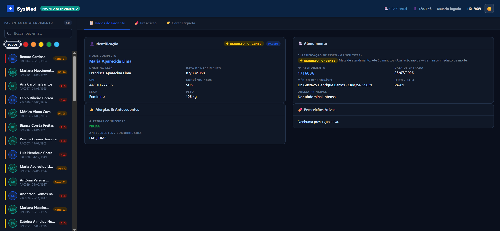
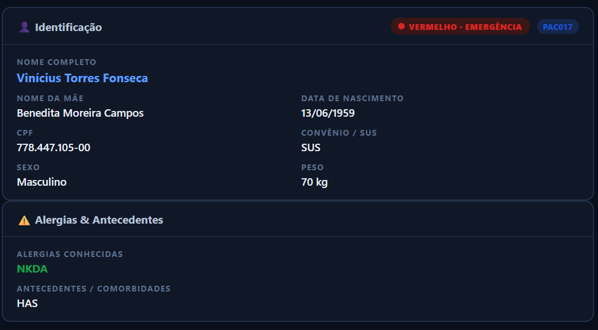
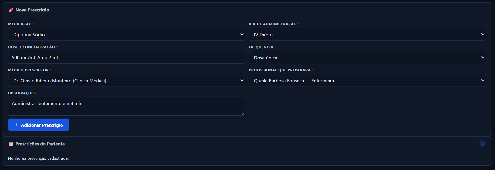
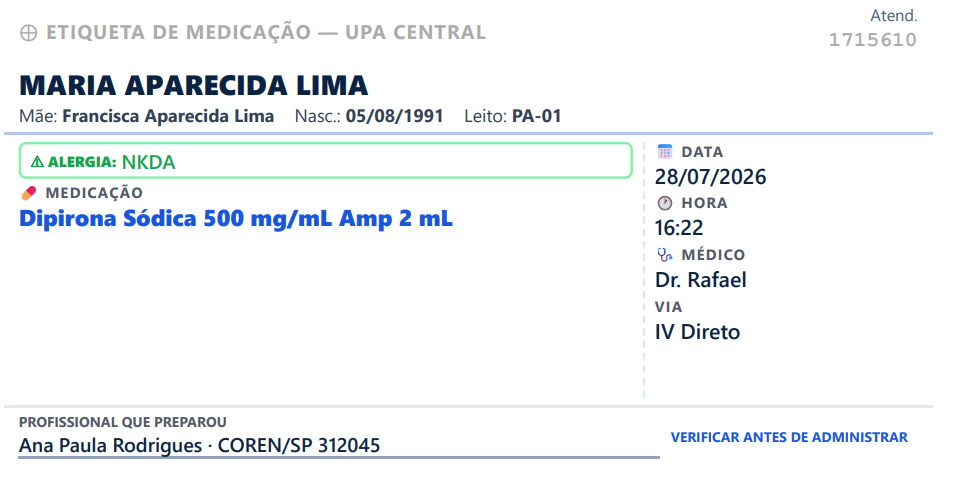

# 🏥 SysMed — Sistema de Etiquetas Hospitalares

Sistema web desenvolvido para simular o processo de gerenciamento de pacientes, prescrições médicas e geração de etiquetas hospitalares para administração de medicamentos.

O objetivo do projeto é aplicar conceitos de desenvolvimento Front-End em um cenário inspirado na rotina hospitalar, priorizando usabilidade, organização das informações e uma interface moderna e responsiva.

> **Projeto desenvolvido para fins acadêmicos e de portfólio. Não possui integração com sistemas hospitalares reais.**

---

## 🚀 Funcionalidades

* 👥 Cadastro e seleção de pacientes
* 🔎 Pesquisa rápida de pacientes
* 🚦 Filtro por Classificação de Risco (Protocolo de Manchester)
* 📋 Visualização completa dos dados do paciente
* ⚠️ Exibição de alergias e antecedentes clínicos
* 💊 Cadastro de prescrições médicas
* 🩺 Seleção de via de administração
* 👨‍⚕️ Associação entre médico prescritor e profissional responsável
* 🏷️ Geração automática de etiquetas de medicação
* 🖨️ Impressão em formato **100 × 50 mm**
* 🌙 Tema Claro / Escuro
* 📱 Interface Responsiva
* 🔔 Sistema de notificações (Toasts)
* ✅ Modal de confirmação para ações críticas

---

## 🛠️ Tecnologias Utilizadas

* HTML5
* CSS3
* JavaScript (Vanilla JS)
* LocalStorage
* Flexbox
* CSS Grid
* Media Queries

---

## 📸 Demonstração

### 🏠 Tela Inicial

### 👤 Dados do Paciente

### 💊 Prescrição

### 🏷️ Etiqueta

---

## 🎯 Objetivos do Projeto

Este projeto foi desenvolvido para praticar:

* Estruturação de interfaces com HTML5
* Estilização avançada utilizando CSS3
* Organização de componentes visuais
* Responsividade
* Manipulação do DOM
* Eventos em JavaScript
* Validação de formulários
* Geração dinâmica de conteúdo
* Impressão personalizada
* Persistência de preferências utilizando LocalStorage

---

## 💡 Diferenciais

* Interface inspirada em sistemas hospitalares reais
* Classificação de risco baseada no Protocolo de Manchester
* Impressão otimizada para etiquetas hospitalares
* Design limpo e intuitivo
* Código organizado e de fácil manutenção
* Compatível com dispositivos móveis

---

## 👩‍💻 Desenvolvedora

**Milena Amaral Dias**

Estudante de Engenharia de Software com foco em Desenvolvimento Front-End.

### Contato

* GitHub: https://github.com/MilenaAmaral
* LinkedIn: https://www.linkedin.com/in/milenaamaraldias/

---

## 📄 Licença

Este projeto foi desenvolvido para fins de estudo, aprendizado e composição de portfólio.
